# zsh-ai-prompt

Zsh plugin that provides an inline AI query mode via ZLE widgets. Press a keybinding to enter AI mode, type a natural language query, and get a shell command back in your buffer — ready to edit or execute.



## Installation

### Oh My Zsh

```bash
git clone https://github.com/hex/zsh-ai-prompt.git ${ZSH_CUSTOM:-~/.oh-my-zsh/custom}/plugins/zsh-ai-prompt
```

Add `zsh-ai-prompt` to your plugins in `~/.zshrc`:

```bash
plugins=(... zsh-ai-prompt)
```

### Zinit

```bash
zinit light hex/zsh-ai-prompt
```

### Antidote

Add to `~/.zsh_plugins.txt`:

```
hex/zsh-ai-prompt
```

### Antigen

```bash
antigen bundle hex/zsh-ai-prompt
```

### Manual

Clone the repo and source the plugin in your `~/.zshrc`:

```bash
git clone https://github.com/hex/zsh-ai-prompt.git ~/.zsh/zsh-ai-prompt
source ~/.zsh/zsh-ai-prompt/zsh-ai-prompt.plugin.zsh
```

## Usage

1. Press **Alt-A** (default) to enter AI mode
2. Type your query in plain English (e.g., "find all .log files older than 7 days")
3. Press **Enter** to submit — a spinner animates while the AI responds
4. The AI's response replaces your buffer — press Enter to execute, or edit first
5. Press **Escape** or **Ctrl-C** to cancel at any time; this also stops a pending request. Enter while the spinner runs cancels too

If the request fails (bad key, unknown model, rate limit, timeout, no network), your original buffer comes back and the error appears below the prompt. The plugin strips a markdown code fence around the response before putting it in the buffer.

A recording of the real thing (`assets/gen-how-it-works-svg.py` draws the animation at the top):


## Configuration

Works out of the box with the `claude` CLI installed — no configuration needed. For other backends, set `ZSH_AI_PROMPT_BACKEND` and have the provider's API key in your environment.

All settings are optional and can be set in your `.zshrc` before the plugin loads:

```bash
# Backend: claude (default), openai, gemini, grok, ollama
ZSH_AI_PROMPT_BACKEND="claude"

# Keybinding (default: Alt-A)
ZSH_AI_PROMPT_KEYBINDING="^[a"

# System prompt sent with every query
ZSH_AI_PROMPT_SYSTEM_PROMPT="Respond with only the command(s), no explanation. No markdown, the command should be a single line and ready to run in the terminal."

# Visual styling (region_highlight format)
ZSH_AI_PROMPT_SYMBOL_STYLE="fg=magenta"
ZSH_AI_PROMPT_TEXT_STYLE="fg=242"

# CLI fallback for backends that support it (default: 1)
# When no API key is set, backends try their CLI tool (claude, gemini) before failing.
# Set to 0 to disable CLI fallback and require an API key.
ZSH_AI_PROMPT_USE_CLI=1

# Seconds before an API request gives up (default: 60). Applies to the
# HTTP backends, not to the claude or gemini CLI.
ZSH_AI_PROMPT_TIMEOUT=60
```

## Backends

Pick one with `ZSH_AI_PROMPT_BACKEND`. Each backend finds its API key in the environment variable it already uses, so most setups need one line. `ZSH_AI_PROMPT_MODEL` overrides the model for whichever backend is active.

| Backend | API key | Default model | Time per query* |
|---|---|---|---|
| `claude` | `ANTHROPIC_API_KEY`, or the `claude` CLI login | `claude-haiku-5-5` (CLI: `haiku`) | under 1 s (CLI: about 4 s) |
| `gemini` | `GEMINI_API_KEY`, or the `gemini` CLI login | `gemini-flash-lite-latest` | about 1 s |
| `openai` | `OPENAI_API_KEY` | `gpt-6-luna` | 2.5–5 s |
| `grok` | `XAI_API_KEY` | `grok-4.7` | 3–6 s |
| `ollama` | none, runs locally | `llama3` | depends on your machine |

\*Measured from one machine on 2026-10-08 with the default system prompt; your numbers depend on network and load.

Faster models if the default feels slow:

```bash
ZSH_AI_PROMPT_BACKEND="openai"; ZSH_AI_PROMPT_MODEL="gpt-5.6-luna"   # 1.3–2.8 s
ZSH_AI_PROMPT_BACKEND="openai"; ZSH_AI_PROMPT_MODEL="gpt-4.1-nano"   # 1–1.9 s
ZSH_AI_PROMPT_BACKEND="gemini"; ZSH_AI_PROMPT_MODEL="gemini-3.5-flash-lite"   # pinned, 0.8 s
ZSH_AI_PROMPT_BACKEND="grok";   ZSH_AI_PROMPT_MODEL="grok-4.20-0309-non-reasoning"   # about 1 s, but sometimes adds prose or searches /
```

### Claude (default)

Uses the Anthropic Messages API if `ANTHROPIC_API_KEY` is set (under a second per query), otherwise falls back to the `claude` CLI (`claude --print`, about 4 seconds). The CLI runs as a plain model call: tools, skills, your user and project settings (hooks, plugins, MCP servers) and session saving are all turned off.

```bash
ZSH_AI_PROMPT_BACKEND="claude"
# With API key: auto-detects $ANTHROPIC_API_KEY, or set explicitly:
# ZSH_AI_PROMPT_API_KEY="sk-ant-..."
# ZSH_AI_PROMPT_MODEL="claude-haiku-5-5"  # default
# ZSH_AI_PROMPT_API_URL="https://..."     # default: https://api.anthropic.com/v1/messages

# Without API key: uses CLI with zero config and existing CLI auth
# ZSH_AI_PROMPT_MODEL="sonnet"  # override CLI model (default: haiku)
```

### OpenAI

Auto-detects `OPENAI_API_KEY` from your environment. Works with any OpenAI-compatible API.

```bash
ZSH_AI_PROMPT_BACKEND="openai"
# Uses $OPENAI_API_KEY automatically, or set explicitly:
# ZSH_AI_PROMPT_API_KEY="sk-..."
# ZSH_AI_PROMPT_MODEL="gpt-6-luna"       # default
# ZSH_AI_PROMPT_API_URL="https://..."    # for compatible APIs
```

### Gemini

Uses the Gemini API if `GEMINI_API_KEY` is set (about 1 second per query), otherwise falls back to the `gemini` CLI.

```bash
ZSH_AI_PROMPT_BACKEND="gemini"
# With API key: auto-detects $GEMINI_API_KEY, or set explicitly:
# ZSH_AI_PROMPT_API_KEY="..."
# ZSH_AI_PROMPT_MODEL="gemini-flash-lite-latest"  # default, or uses $GEMINI_MODEL; tracks the newest Flash Lite
# ZSH_AI_PROMPT_API_URL="https://..."  # default: Gemini's OpenAI-compatible endpoint

# Without API key: uses CLI with zero config and existing CLI auth
# ZSH_AI_PROMPT_MODEL="gemini-3.5-flash-lite"  # override model (any Gemini model id)
```

### Grok

Uses xAI's OpenAI-compatible API. Auto-detects `XAI_API_KEY` from your environment.

```bash
ZSH_AI_PROMPT_BACKEND="grok"
# Uses $XAI_API_KEY automatically, or set explicitly:
# ZSH_AI_PROMPT_API_KEY="xai-..."
# ZSH_AI_PROMPT_MODEL="grok-4.7"         # default
# ZSH_AI_PROMPT_API_URL="https://..."    # default: https://api.x.ai/v1/chat/completions
```

### Ollama

Queries a local Ollama instance. No API key needed.

```bash
ZSH_AI_PROMPT_BACKEND="ollama"
# ZSH_AI_PROMPT_MODEL="llama3"                          # default
# ZSH_AI_PROMPT_OLLAMA_URL="http://localhost:11434"      # default
```

## Dependencies

- **zsh** 5.3+ (for region_highlight, zle -F widget mode and add-zle-hook-widget)
- **jq** and **curl** 7.75+ (for API backends — not needed when using the claude or gemini CLI)
